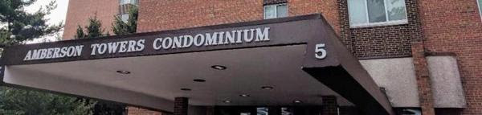

--- 
title: "Governing Documents  Amberson Towers Condominums"
date: "Last Association Revision: October 13, 2021; Last Draft Build: February 15, 2020"
site: bookdown::bookdown_site
fontsize: 14pt
font: Arial
documentclass: book
bibliography: [book.bib, packages.bib]
# url: your book url like https://bookdown.org/yihui/bookdown
cover-image: amber.jpg
description: 
  This document is a copy of Amberson Towers Documents on https://ambersontowers.com/governance/bylaws that are under consideration for revision. 
link-citations: yes
github-repo: rstudio/bookdown-demo
---

# {-}

## Three Documents Define Governance {-}

 The governing documents of Amberson Towers comprise three separate documents:

- **The Rules and Regulations** - General rules which can be amended by a majority vote of the Council.  Last amended in approximately September 2018.

 
- **The Declaration** - Mostly detailed information about the building, such as surveyor's coordinates and voting share of each unit.  Takes precedence over other documents. Requires agreement of 60% owners to amend.  First filed on March 14, 1978 and amended twice, most recently September 12, 1978, but only with very minor changes.

- **The Code of Regulations** - Regulates how the building is governed, for example how Council is elected.  Requires agreement of 60% ow owners to amend. First filed  April 12, 1978 and has been amended seven times (September 1978, 1990, 1994, 1996, 2000, 2016, and 2017).

Provided in [Appendix A](#documents) are links to source doxcuments for *The Declaration* and *The Code of Regulations*.

***

> **Notes & Disclaimer:**  This publication has been produced for the convenience of our residents and users. It is an unofficial reproduction of the original documents and any amendments thereto. This version of the Code of Regulations integrates all revisions into one consolidated document. The official recorded documents should be consulted for all interpretations and applications. They are the primary source and documents for all purposes. Copies of the official documents may be inspected and obtained in the Meyers Management office. In the event of an error, misprint, omission, or conflict between the within versions and the official documents, the official printed and recorded documents shall govern and be controlling.